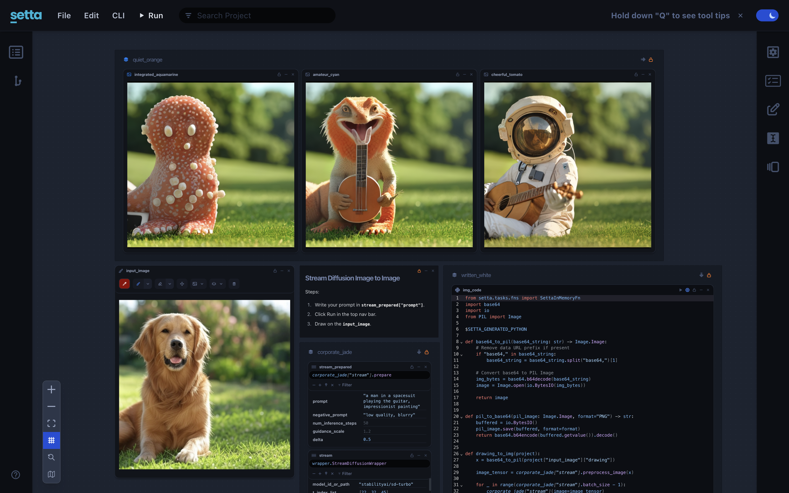
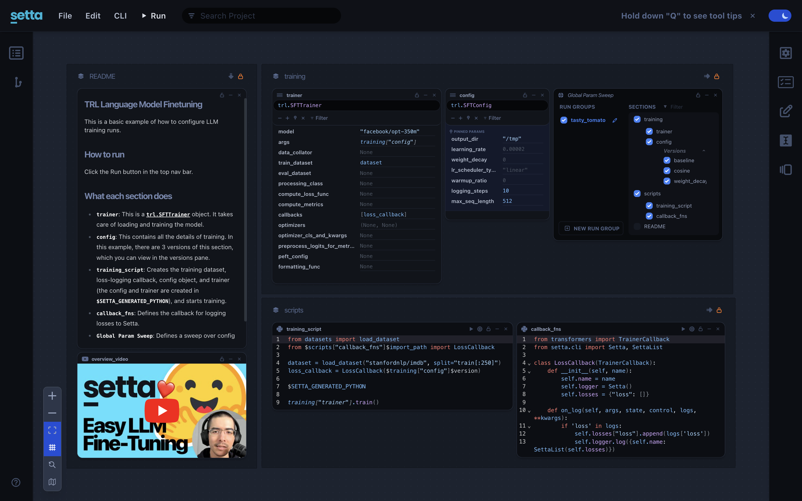
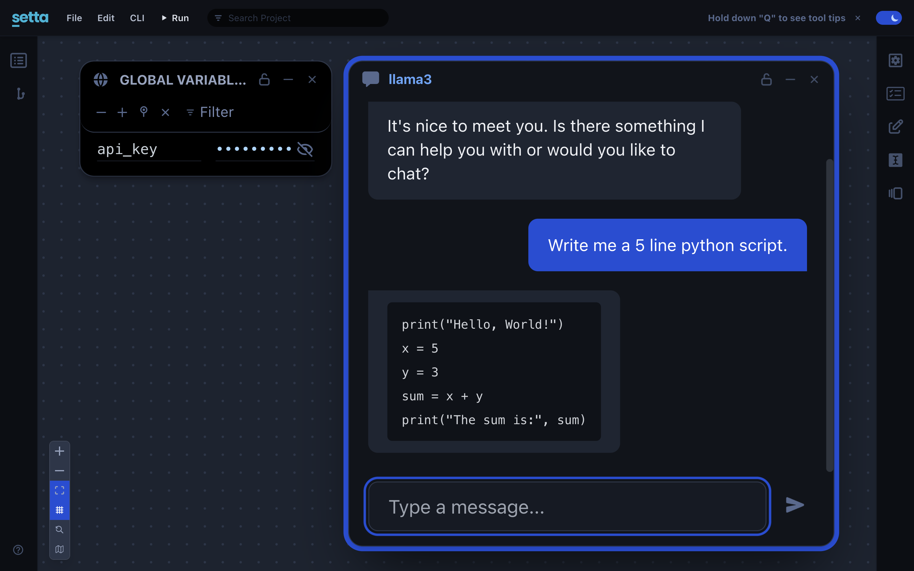
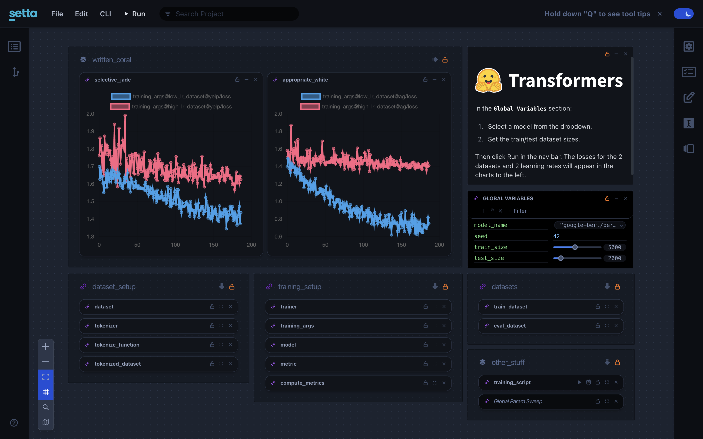
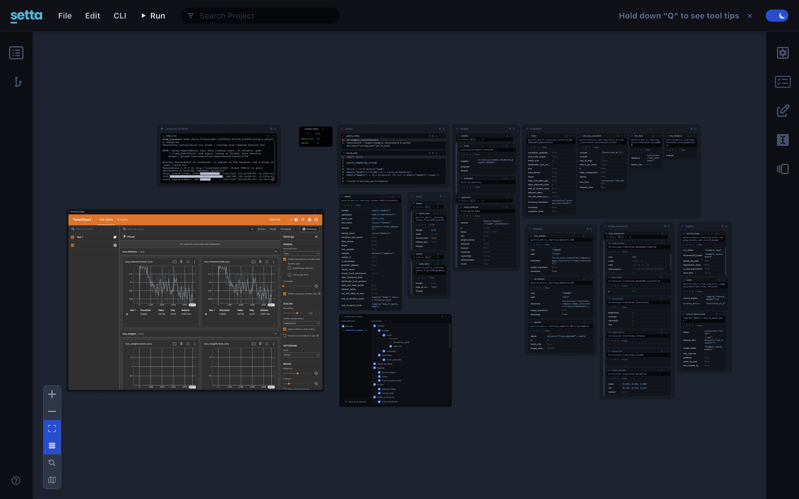

## No More Donkeywork!

We’re excited to launch **Setta**, a **general purpose, open-source tool for Python** by [Kevin Musgrave](https://github.com/KevinMusgrave) and [Jeff Musgrave](https://github.com/JeffMusgrave). It reimagines how you handle Python configurations and user interfaces while eliminating complexity that comes with existing solutions. So, go ahead, you can delete your YAML parsers, configuration files, _and_ frontend code!

## What Is Setta?

Setta is a developer tool that **unifies Python configuration and UI.** Instead of scattering config files and building custom frontends, you can:

- **Expose Python functions as interactive UIs** Just type in the name of your function from your codebase – No frontend code required!
- **Eliminate boilerplate parsers**—no more YAML or JSON for your configs
- **Share and configure easily**—everyone from engineers to non-technical users can tweak parameters in a friendly interface

Whether you’re tuning large AI models or writing a simple script, Setta turns your Python code into an interactive application with minimal overhead.

## Try It First!

Want to try it now, instead of reading the rest of this blog post? See our [Getting Started guide](https://github.com/settadev/setta?tab=readme-ov-file#getting-started), or check out our [example projects](https://github.com/settadev/examples). They're easy to run!

### [Stream Diffusion Image-to-Image](https://github.com/settadev/examples/tree/main/stream_diffusion_img_to_img)

Sketch in real time to generate AI-enhanced images.

---

### [Hugging Face TRL Language Model Finetuning](https://github.com/settadev/examples/tree/main/trl_language_model_finetuning)

Experiment with Hugging Face TRL training configurations.

---

### [Llama 3 Chat UI powered by the Groq API](https://github.com/settadev/examples/tree/main/groq_api_chat)

Custom chat UIs are made easy with Setta! In this example we take a look at how you can quickly transform a small python script into a useable Chat UI powered by Groq and Llama 3.

---

### [Transformers Sequence Classification](https://github.com/settadev/examples/tree/main/transformers_trainer)

Train text classifiers with minimal setup.

---

### [PyTorch Metric Learning](https://github.com/settadev/examples/tree/main/pytorch_metric_learning_trainer)

Finetune embeddings using various metric learning methods.

## Why Setta Is Betta

Traditional workflows involve writing Python functions, creating separate config files, building parsers, and making (or remaking) a frontend when parameters change. Setta merges configuration and UI in one place. Simply right click and add a card in Setta, type your function’s name, and all its arguments will appear. Set interface elements like sliders, color pickers, or switches for each parameter to your heart’s content!

## What Setta Is _Not_

- **Not a WYSIWYG Web Builder**: Setta won’t generate custom HTML pages or pixel-perfect UIs. It produces standardized, interactive components inside its own interface.
- **Not a Visual Programming System**: You still write regular Python. Setta just provides a streamlined UI so you and other users can interact with your functions without wrestling with frontend code or config files.

## How Setta Empowers Developers and Users

- **Unified Configuration and UI**: Config and frontend tools solve parts of the puzzle while adding complexity. Setta treats your config and UI as one, while eliminating the config and UI code complexity entirely.
- **Rich, Interactive Experiences**: Insert markdown docs, tooltips, or YouTube videos so users can learn as they go—no diving into separate READMEs.
- **Flexible Usability**: Hide less-used functions to keep the UI clean. We’ve also got upcoming features like meta controls and user modes that will further simplify the interface for different audiences.
- **Effortless Sharing**: Hand off your project to anyone; they can explore the UI and learn what they need, without constant help from you.

## What’s Next?

We're actively developing Setta with new features and improvements. In our latest releases, we've added:

- Support for chat interfaces through a new "Chat" section type
- Artifact management improvements
- Bug fixes compatibility

And there's a whole lot more on the way!

## Join the Setta Community

- Check out our [documentation](https:docs.setta.dev)
- Join our [Discord community](https://discord.gg/MmHJz75bZ5)
- Star us on [GitHub](https://github.com/settadev/setta)
- Try our [example projects](https://github.com/settadev/examples)
- Follow us on [X](https://x.com/settadev)
